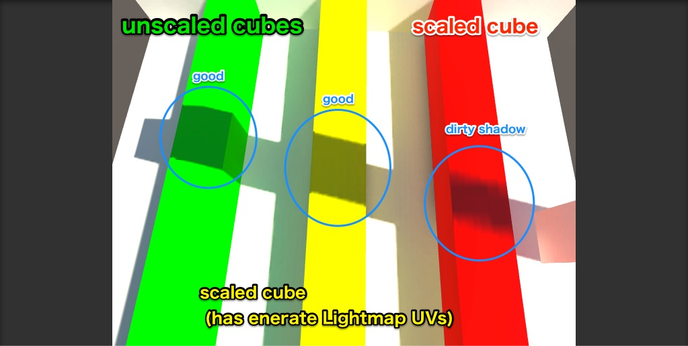
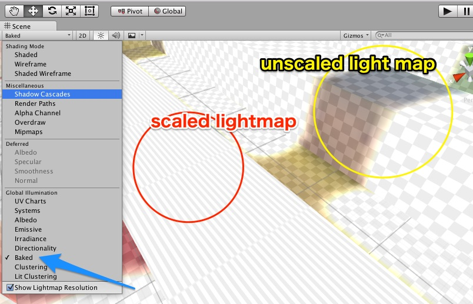
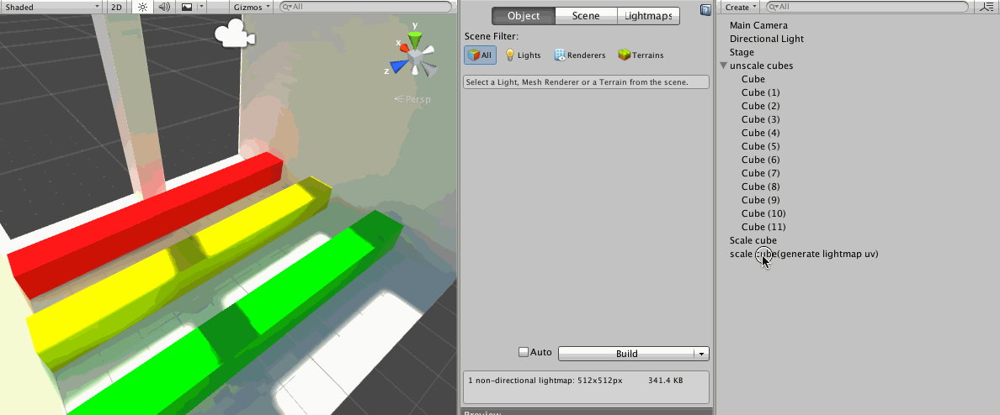
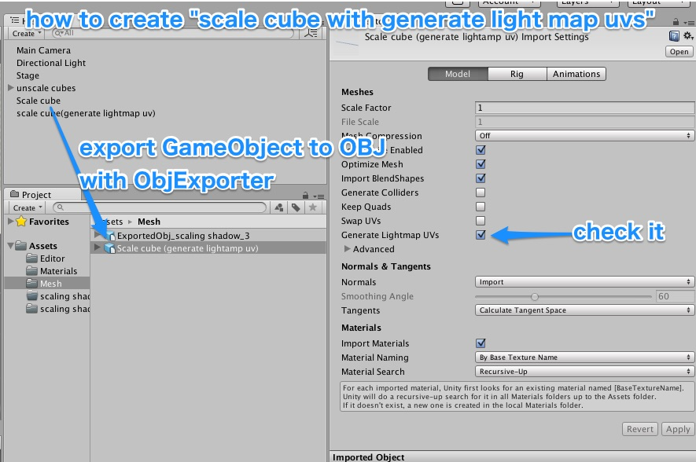

#stretch Lightmap Sample

If you make the stage stretchd the Cube, it might be able to see the dirty shadow.

##What happen

Light map of UV are consistent with the UV of the object.
In other words, when you scale an object, might light map is extended.

A simple scaling, the problem does not occur.

##How to fix it?

lets generate lightmap uvs.

1.  export gameObject to OBJ files. by http://wiki.unity3d.com/index.php?title=ObjExporter
2.  check "generate lightmap uvs"
3.  replace gameObjects.

or don't not use Baked GI.

#original article

http://tsubakit1.hateblo.jp/entry/2016/04/21/003737